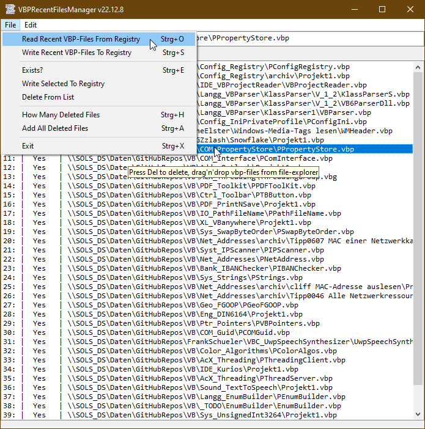

# Config_Registry  
## Registry functions  

Project started in summer 2006, the module Registry works similar to registry in Delphi 7  
Works in VBC/VBA x86,x64 and supports Unicode through the W-functions of the advapi-registry api. 
(Started also mimiking the .net RegistryKey class, but this work is not finished yet).  
From version 22.12.8 on the testing gui for the module changed completely.  
Now it has become a tool for managing the recent file list of VB6-projects.  
For compiling this yourself, you need additionally the following repos:  
* [Ptr_Pointers](https://github.com/OlimilO1402/Ptr_Pointers) 
* [Err_CorrectErrorHandling](https://github.com/OlimilO1402/Err_CorrectErrorHandling)
* [IO_PathFileName](https://github.com/OlimilO1402/IO_PathFileName)
* [Sys_Strings](https://github.com/OlimilO1402/Sys_Strings)
* [IO_PathFileName](https://github.com/OlimilO1402/IO_PathFileName)

